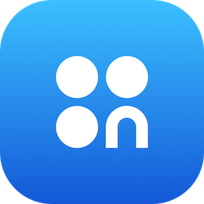

    

<h1 align="center">OnsideKit for iOS</h1>

  

The **OnsideKit SDK** allows you to seamlessly integrate in-app purchases and subscriptions into your applications. It handles the entire payment flow, providing a secure and reliable experience for your users while simplifying the implementation process for you.

## Features
*   **✨ Familiar StoreKit-like API**: Designed to be highly similar to Apple's native StoreKit framework, ensuring a minimal learning curve for experienced iOS developers.
*   **💳 Multiple Payment Methods**: Securely process payments via **Apple Pay** and **Bank Cards**.
*   **🔄 Unified Purchase Flow**: A single, streamlined process for handling both one-time in-app purchases and recurring subscriptions.
*   **⚙️ Flexible Payment Processing**: Support for both one-stage (immediate charge) and two-stage payments (authorize and capture later).

## Requirements
*   iOS 16.0+
*   Xcode 14.0+

## Getting Started
1.  **Configure Products**: Set up your paid apps, in-app purchases, and subscriptions in the [Onside Developer Console](https://developer.onside.io). This will allow you to get the product identifiers needed to work with the SDK.
2.  **Integrate the SDK**: `OnsideKit` distributes as a pre-compiled binary framework (`.xcframework`) for fast build times and simple integration. You can add it to your project using Swift Package Manager, CocoaPods, or by manually linking the framework.
For detailed instructions on all installation methods, please refer to our official documentation:
#### ➡️ **[View Full Installation Guide](https://docs.onside.io/sdk/installation-guide)**

## Documentation
For a complete guide on how to use `OnsideKit`, including configuration, authentication, making purchases, and API reference, please visit our official documentation portal.

#### ➡️ **[Read the Full Documentation](https://docs.onside.io/sdk/)**

## Support
If you have questions about SDK integration, monetization, or want to provide feedback, please reach out to our developer support team:
*   **Email**: [support@onside.io](mailto:support@onside.io)
*   **Chat**: Use the chat feature in the developer console.

## License
`OnsideKit` is released under the MIT License. See the [`LICENSE`](https://github.com/onside-io/OnsideKit-iOS/blob/main/LICENSE) file for more information.